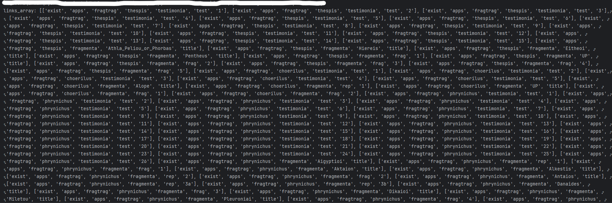

This is a url to urn converter script named WebScraber for project FragTrag (https://fragtrag1.upatras.gr/exist/apps/fragtrag/index.html).

This is only a pre-release of the final version and there is more things to be done.

One of the project's main objectives is to describe the algorithm for the creation of urns contained in platform FragTrag.

The script creates a two dimensional array (links_array) which contains required information for implimenting FragTrag urns, an array of all the urls (urls_array) to be interpreted and an array of the urns (urns_array) exported by the script. Each extracted link (url) is seperated in seven [7] elements that describe the content to which the link refers. These elements are used in composing the final list of urns exported as a text file with the name <a href="Docs/urns.txt" target="_blank">urns.txt</a>. Additionaly a file with all the urls extracted be WebScraber is being created for future reference and debugging of resutls (A sample of the file exported can be found <a href="Docs/urls.txt" target="_blank">here</a>).

<figure><figcaption>Array screenshot from debugger</figcaption></figure>

Moreover an attempt is being done to describe the algorithm behind which the urns are being created trying to build a standardized method.

